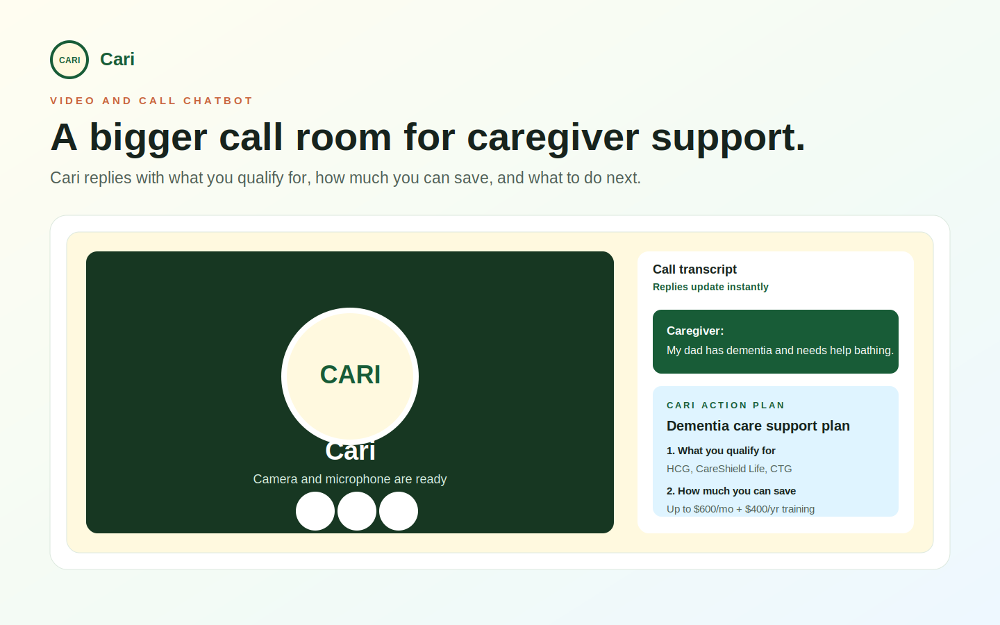
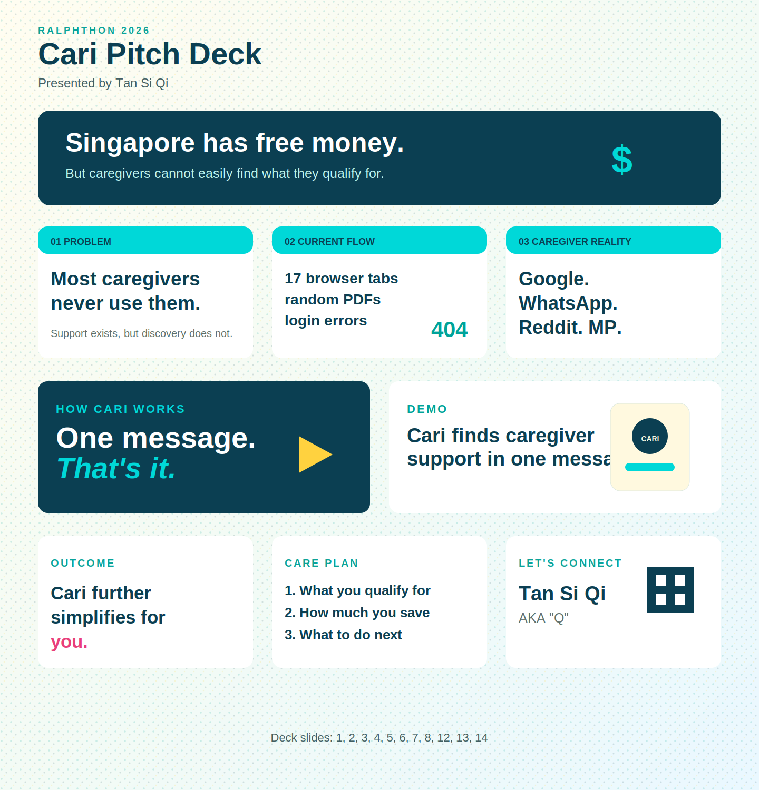

# Cari

Singapore caregiver relief planner. Give it one message to turn care chaos into money, documents, follow-ups, and support.



Cari parses a caregiver's situation, matches eligibility across Singapore grants and subsidies, and returns a plain-English relief plan ordered by financial impact and effort saved.

## Relief Tracks

Cari is designed for caregivers who are often working full-time while coordinating parents, siblings, helpers, hospitals, and money.

It now organises each answer into:

- Money relief
- Document readiness
- Family task split
- Care team handoff
- Caregiver stress support

## Pitch Deck



## What Cari Returns

Every caregiver reply is broken into:

1. **What you qualify for**
2. **How much you can save**
3. **What to do next**

Each relief plan includes buttons to call AIC, open relevant grant pages, prepare a referral email, collect documents, split family tasks, and ask for caregiver support.

## Care Team Handoff

Cari can prepare a referral note for organisations the caregiver may need help from, such as AIC, community care teams, social workers, or caregiver support services.

Once an organisation accepts the referral, its members can help with:

- Follow-up emails
- Phone calls
- Grant application guidance
- Caregiver support planning
- Mental health or therapy referrals when caregiving stress is high

Caregiving can feel like having two jobs: a full-time job and a caregiving job. Cari treats emotional support as part of the care plan, not an afterthought.

## Deploying to Vercel

This is a static app. No build command is required.

Required files:

```text
index.html
assets/cari-screenshot.svg
assets/cari-pitch-deck.svg
README.md
```

Camera and microphone access work best on HTTPS, which Vercel provides automatically.
